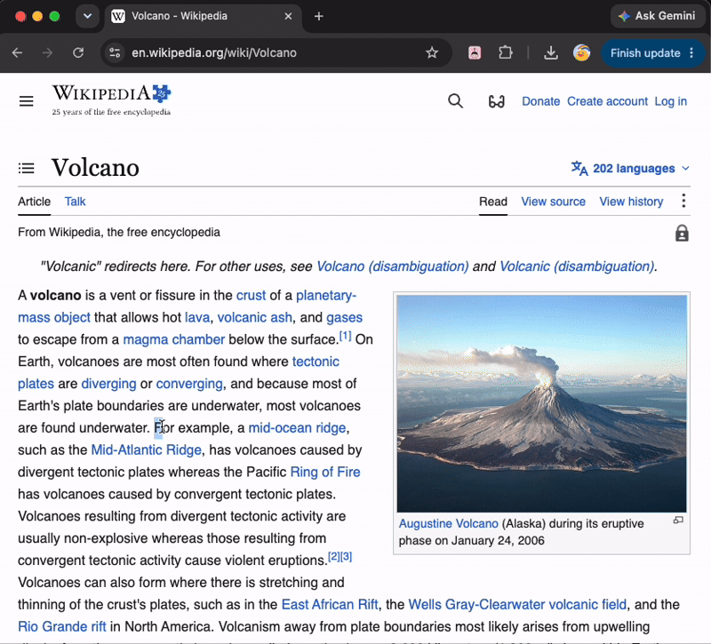

# Explain Like I'm 5: Chrome Extension

Highlight any text on a webpage → get a simple explanation powered by your choice of AI model.



Built this because dense articles, papers, and docs often bury the actual point in jargon. Instead of switching tabs to look something up, you highlight it and get a plain-English explanation right there, with a "simplify more" option if the first pass still isn't clear enough.

## Features

- **Highlight-to-explain** on any webpage, with surrounding context (1000 chars before/after) sent along so explanations stay accurate, not just literal
- **3 AI models to choose from**: Gemini 2.0 Flash, Llama 3.3 70B (Groq), Gemma via OpenRouter, all free-tier
- **Per-model usage tracking**: live progress bars in the popup show daily quota used per model, plus a global daily cap across all three
- **Automatic retry with backoff** for upstream rate limits (OpenRouter's free tier occasionally 429s under load; this is handled transparently instead of surfacing a raw error)
- **XSS-safe by design**: all AI output and page content rendered via `textContent`/`innerText` only, never `innerHTML`

## Project Structure

```
eli5/
├── extension/               # Chrome extension (frontend)
│   ├── manifest.json        # Extension config, permissions
│   ├── content/
│   │   └── content.js       # Injected into pages, grabs highlight + context
│   ├── popup/
│   │   ├── popup.html       # Extension popup UI
│   │   ├── popup.js         # Popup logic, talks to content.js + backend
│   │   └── popup.css        # Popup styles
│   └── icons/               # Extension icons (16, 48, 128px)
│
└── backend/                 # FastAPI backend (Python)
    ├── main.py              # App entrypoint, CORS, routes
    ├── routers/
    │   └── explain.py       # POST /explain and GET /usage endpoints
    ├── services/
    │   ├── gemini.py        # Gemini 2.0 Flash handler
    │   ├── groq.py          # Groq/Llama handler
    │   └── openrouter.py    # Gemma (via OpenRouter) handler, with retry/backoff
    ├── middleware/
    │   └── rate_limit.py    # Global + per-model daily call counters
    ├── .env.example         # API key template (never commit .env)
    ├── requirements.txt
    └── .gitignore
```

## Setup

### Backend

```bash
cd backend
python -m venv venv
source venv/bin/activate
pip install -r requirements.txt
cp .env.example .env   # fill in your API keys
uvicorn main:app --reload
```

Requires **Python 3.11+** (3.9 breaks `cryptography`/`google-genai`).

### Extension

1. Open Chrome → `chrome://extensions`
2. Enable Developer Mode
3. Click "Load unpacked" → select the `extension/` folder
4. Copy the extension ID → paste into `backend/.env` as `EXTENSION_ID`
5. Restart the backend after updating `.env`
6. Pin the extension to your toolbar

## Usage

1. Highlight any text on a webpage (under 500 words)
2. Click the ELI5 extension icon
3. Pick a model: Gemini Flash, Llama (Groq), or Gemma
4. Hit **Explain**. Not simple enough? Hit **Simplify more**.

## Rate limits

Each model has its own free-tier daily cap, tracked separately from a 500 calls/day global limit (all reset at midnight UTC):

| Model | Daily cap |
|---|---|
| Gemini 2.0 Flash | 100 (documented free-tier RPD) |
| Llama 3.3 70B (Groq) | 1000 (conservative estimate, Groq doesn't publish a fixed cap) |
| Gemma (OpenRouter) | 50 (documented free-model cap) |

A request must pass both the model-specific and global check to go through. Usage bars in the popup update live after every call.

## Known limitations / what's next

- Groq's daily cap is an estimated ceiling, not an official number; will tighten this once Groq publishes one
- No persistent usage history; counters reset at midnight UTC with no long-term storage
- Placeholder extension icons; final branding in progress
